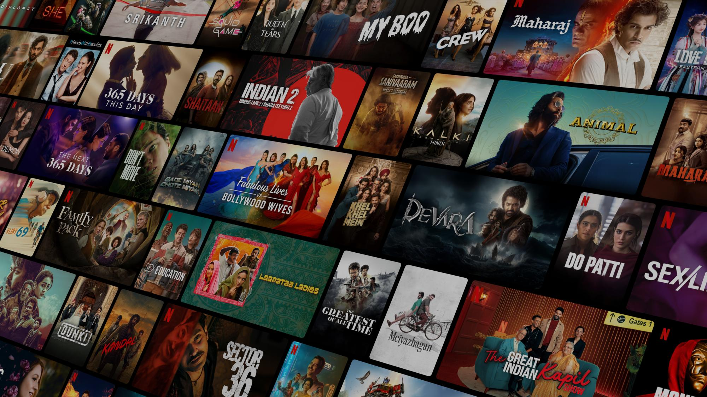

# 🎬 Netflix Clone

A static **Netflix-inspired landing page**, built with pure **HTML** and **CSS**. This is a front-end project that reflects my dedication to learning and improving web design skills.

## 🌟 Features

- 🎨 Sleek, responsive UI modeled after Netflix
- 💡 Modern layout using Flexbox and CSS Grid
- 🎯 Pixel-perfect hero section with background image
- 🧱 Clean and organized HTML & CSS structure
- 📱 Fully responsive design for mobile and desktop

## 📸 Screenshots



## 🛠️ Technologies Used

- HTML5
- CSS3
- Google Fonts
- Font Awesome (optional for icons)

## 🚀 Getting Started

Clone the repository and open `index.html` in your browser:

```bash
git clone https://github.com/your-username/netflix-clone.git
cd netflix-clone
open index.html
